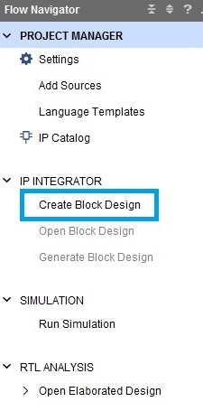
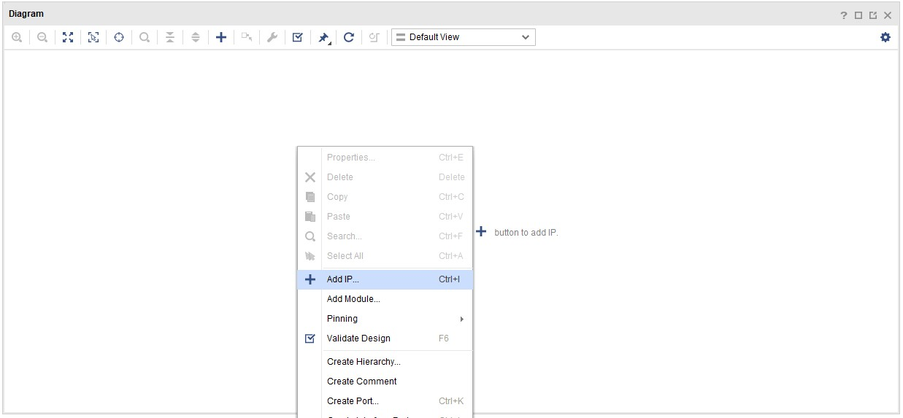

## Steps
### Create a Vivado Project

1.	Open Vivado by selecting **Start > All Programs > Xilinx Design Tools > Vivado 2021.2**
1.	Click **Create Project** to start the wizard. You will see the Create a New Vivado Project dialog box. Click Next.
1.	Click the Browse button of the Project Location field of the New Project and browse to **{labs}**, and click Select.
1.	Enter **lab1** in the Project Name field.  Make sure that the **Create Project Subdirectory** box is checked.  Click Next.
1.	In the Project Type form select **RTL Project**, and check the box **Do not specify sources at this time**. Click **Next**
1.	In the Default Part window, select the Boards tab, and depending on the board you are using, (if you can't find the board you are looking for, refer to  for setup) and click Next.

    

    
    

    

    <i>Boards and Parts Selection</i>
    

1.	Check the Project Summary (should be similar to what you see below) and click Finish to create an empty Vivado project.
    

    
    

    

    <i>Project Summary</i>
    

### Creating the System Using the IP Integrator

1.	In the Flow Navigator, click **Create Block Design** under IP Integrator.
    

    
    

    

    <i>Create IP Integrator Block Diagram</i>
    

1.	Enter **system** for the design name and click OK.

1.	Right-click anywhere in the Diagram workspace and select **Add IP**.
    

    
    

    

    <i>Add IP to Block Diagram</i>
    
        

1.	Once the **IP Catalog** opens, type “zynq” into the Search bar, find and double click on **ZYNQ7 Processing System** entry, or click on the entry and hit the Enter key to add it to the design.

1.	Notice the message at the top of the Diagram window in a green label saying that Designer Assistance available. Click **Run Block Automation**.  

1.	A new window pops up called the Run Block Automation window. In it, select **/processing_system7_0**, leave the default settings and click OK.

1. Once Block Automation has been completed, notice that ports have been automatically added for the DDR (double data rate, a type of memory) and Fixed IO, and some additional ports are now visible. The imported configuration for the Zynq related to the board has been applied which will now be modified. The block should finally look like this:
