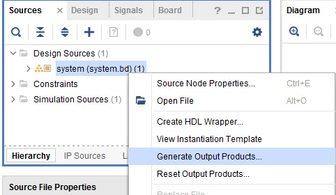
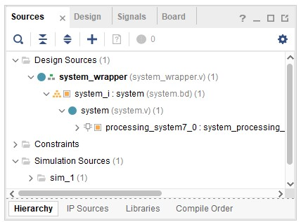

## Steps
### Create a Vivado Project

1.	Open Vivado by selecting **Start > All Programs > Xilinx Design Tools > Vivado 2021.2**
1.	Click **Create Project** to start the wizard. You will see the Create a New Vivado Project dialog box. Click Next.
1.	Click the Browse button of the Project Location field of the New Project and browse to **{labs}**, and click Select.
1.	Enter **lab1** in the Project Name field.  Make sure that the **Create Project Subdirectory** box is checked.  Click Next.
1.	In the Project Type form select **RTL Project**, and check the box **Do not specify sources at this time**. Click **Next**
1.	In the Default Part window, select the Boards tab, and depending on the board you are using and click Next.

    

    
    

    

    <i>Boards and Parts Selection</i>
    

1.	Check the Project Summary (should be similar to what you see below) and click Finish to create an empty Vivado project.
    

    
    

    

    <i>Project Summary</i>
    

### Creating the System Using the IP Integrator

1.	In the Flow Navigator, click **Create Block Design** under IP Integrator.
    

    
    

    

    <i>Create IP Integrator Block Diagram</i>
    

1.	Enter **system** for the design name and click OK.

1.	Right-click anywhere in the Diagram workspace and select **Add IP**.
    

    
    

    

    <i>Add IP to Block Diagram</i>
    
        

1.	Once the **IP Catalog** opens, type “zynq” into the Search bar, find and double click on **ZYNQ7 Processing System** entry, or click on the entry and hit the Enter key to add it to the design.

1.	Notice the message at the top of the Diagram window in a green label saying that Designer Assistance available. Click **Run Block Automation**.  

1.	A new window pops up called the Run Block Automation window. In it, select **/processing_system7_0**, leave the default settings and click OK.

1. Once Block Automation has been completed, notice that ports have been automatically added for the DDR (double data rate, a type of memory) and Fixed IO, and some additional ports are now visible. The imported configuration for the Zynq related to the board has been applied which will now be modified. The block should finally look like this:

    

    
    

    

     <i> Zynq Block with DDR and Fixed IO ports</i>
    
  

  1.	Right-click anywhere in the Diagram workspace and select **Add IP**.
  1.   “XADC” into the Search bar, find and double click on **XADC Wizard** entry, or click on the entry and hit the Enter key to add it to the design.
  1.   Click  **Run Block Automation**  , select all automation click OK.

       

       
       

       

        <i> System Assembly View after Adding the XADC Wizard</i>
        
  
 ### Configure the XADC IP
 1. Double-click on the XADC IP. 
 1. Click the basic tab. 
 1. Select: AXI4Lite, Channel Sequncer, Continuous Mode and KSPS=200.
 1. (ADC Conversion Rate can change but max 1000)
 1. Click the alarms tab, All alarms disabled.
 1. Click the Single Channel and Select channel VAUXP1 VAUXN1 and channel enable
 1. Close XADC Wizard
 1. Right click on the VAUX1 and select the make a external. Change name (A0).
 1. Right-click anywhere in the Diagram workspace and select **Add IP**.
 1. “Constant” into the Search bar, find and double click on **Constant**
 1. Click on Fixed IP and set Const val to 0. Connect to vn_in and vp_in.

     

       
       

       

        <i> Block Design View </i>
        
 
1.Click on the Validate Design button and make sure that there are no errors.
1. Creat a XDC file and add pins. 
1.   set_property -dict { PACKAGE_PIN Y11  IOSTANDARD LVCMOS33 } [get_ports { A0 }]; 
1.   set_property -dict { PACKAGE_PIN Y12   IOSTANDARD LVCMOS33 } [get_ports { vauxn1 }];

### Generate Top-Level and Export hardware

1.	In the sources panel, right-click on **system.bd**, and select **Generate Output Products…** and click Generate to generate the Implementation, Simulation and Synthesis files for the design (You can also click on **Generate Block Design** in the Flow Navigator pane to do the same).
    

    
    

    

    <i> Generating output products </i>
    
  

1. Right-click again on system.bd, and select Create **HDL Wrapper…** to generate the top-level VHDL model. Leave the **Let Vivado manager wrapper** and **auto-update** option selected, and click OK.

    The system_wrapper.v file will be created and added to the project.  Double-click on the file to see the content in the Auxiliary pane.
    

    
    

    

    <i> The HDL Wrapper file generated and added to the project </i>
    
  

1. Notice that the Verilog file is already set as the top module in the design, indicated by the icon.
1. Generate Bitstream launch. 
1. Select **File > Export > Export hardware** and click OK. Select include bitstream option.

1. Basic information about the hardware configuration of the project can be found in the Xilinx Support Archive (XSA) file, along with the Address maps for the PS systems, and driver information. The .xsa file is used in the software environment to determine the peripherals available in the system, and their location in the address map.

###  Vitis IDE

1. Select **Tools > Launch Vitis IDE**, and Select the workspace location with any given location path. Click Launch. The Vitis IDE opens.
1. Review the Welcome page and close it. Click **Create Application Project**, and click Next.
1. In the Platform Selection window, select **Create a new platform from hardware (XSA)** and browse to select the system_wrapper.xsa file exported before. (Default is in the {labs}\lab1 folder).
1. Enter **lab1_platform** as the _Platform name_, click **Next.**
    

    
    

    

    <i> Select a platform to create the project </i>
    
 

1. In the project details window, name the project **lab1**, and in the Target Processor selection, select **ps7_cortexa9_0**.

1. Select **Hello World** as the template in the Template Selection window. Click **Finish**.
1.(It can select empty application C but maybe error can accury 'not included plathorm.h')
   

    
    

    

    <i> Select a template to create the project </i>
    
 

1.	Expand folders in the Explorer view on the left, and observe that there are two projects – lab1_platform, and lab1_system.  The **lab1_system** project is the application that we will use to verify the functionality of the design.  The **lab1_platfrom** is a platform project includes the ps7_init function which initializes the PS as part of the first stage bootloader. The Explorer view should look something like this:
    

    
    

    

    <i> The Project Explorer view </i>
    
  

1. Open the memorytest.c file in the **lab1_system > lab1 > src**, and examine the contents.  This file calls the functions to test the memory.

1. Build the application project either by clicking the hammer button or by right-clicking on the application project and selecting Build Project as shown in following figure. As the project builds, you can see the output in the Console window.
    

    
    

    

    <i> Build the application project </i>
    
  

### Test in Hardware

1.	Make sure that micro-USB cable(s) is(are) connected between the board and the PC. Change the boot mode to JTAG. Turn ON the power of the board.
1. Open a serial communication utility for the COM port assigned on your system. The Vitis software platform provides a serial terminal utility will be used throughout the tutorial. You can also use your preferred serial terminal application.
   * To open this utility, select **Window > Show view**.
   * In the Show View dialog box, type **terminal** in the search box.
   * Select **Vitis Serial Terminal** and click **Open**.
    

    
    

    

    <i> Open the Vitis Serial Terminal </i>
    

 
1. Click the Add button in the Vitis Serial Terminal to connect to a serial terminal. Select the port from the dropdown menu. Keep the Advanced Settings as-is. Click OK.
   

    
    

    

    <i> Connect to serial port </i>
    

1. Right-click **lab1_system > lab1** and select **Launch Hardware (Single Application Debug)**.
    

    
    

    

    <i> Launch Run Configurations </i>
    

1. You should see the following output on the Terminal tab.
    

    
    

    

    <i> Connect to serial port </i>
    

1. Close Vivado and Vitis IDE by selecting **File > Exit** in each program.
     
